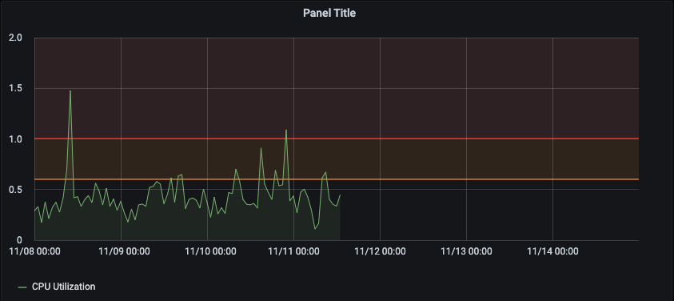
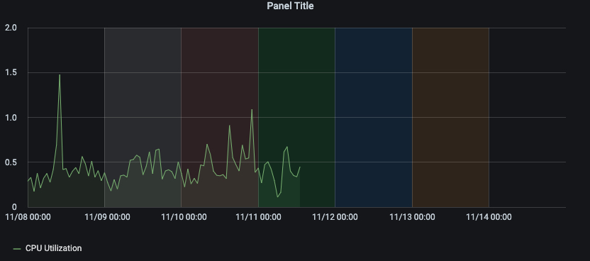
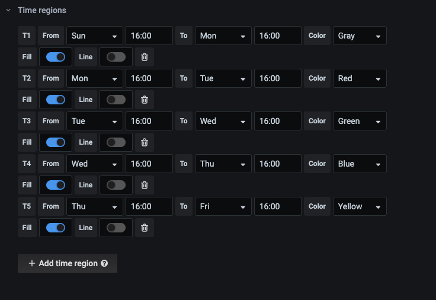

# Panel Graph

Graph 是 Grafana 主要的 一种图形类型。用来进行折线图、竖向柱状图的表示。

在 Visualization 中 选择 Graph 就可以使用该图表。

基于 Grafana v7.0.x 进行描述

# Display 

# Series overrides

# Axes

# Legend

# Thresholds

Thresholds 来表示阈值的设置，可以在图形中设置阈值，
点击添加可以添加一个阈值，该阈值会以一条带颜色的横向直线在图中显示。其中有以下参数需要设置

每一个阈值都已 Tx 来进行表述，第一个规则是 T1 ，选择判断条件和阈值，gt 是大于，lt 是小于，后边跟阈值。剩下就是设置阈值的样式，首先是颜色选项 Color ,有 4 个选项可以选择，分别是 custom、critical、warning、ok ，custom 是自定义颜色，其他三种都是固定颜色，分别是红、黄、绿。Fill 表述是否显示阴影，Line 表示是否显示线条，Y-Axis 表示依据哪条 Y 轴的数值来进行判断，一般选择 left ，左边的 Y 轴，也可以选择右边的 Y 轴。

效果如图所示：

# Time regions
该选项用来设置时间区域，可以对图形上的数据按照时间来进行不同的阴影颜色来进行区分。时间精度最小到分钟，但是时间显示是以 UTC 时间来进行判断的，和北京时间相差 8 小时。

调整好的效果如下所示

使用的参数如下所示

# Data links

# Links

# Repeat options

